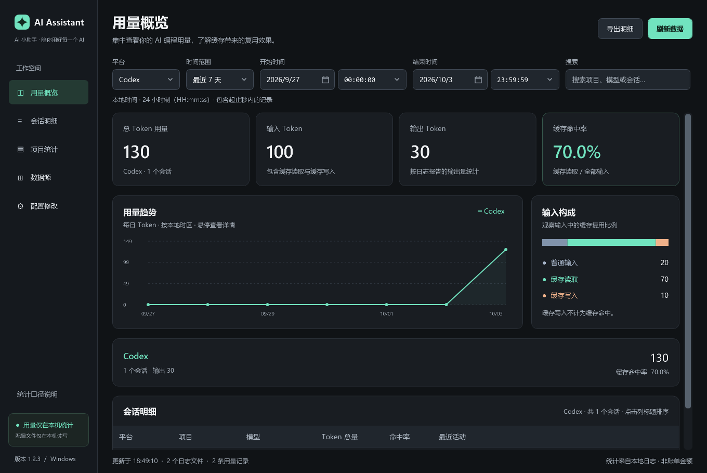
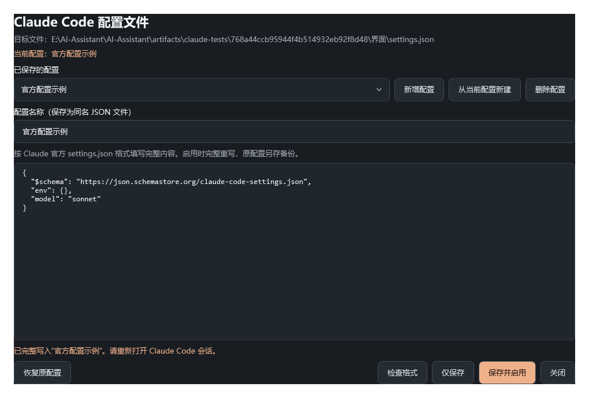

# Ai 小助手

“Ai 小助手 · 陪你用好每一个 AI”：统计 Codex 与 Claude Code 本地 Token 用量、缓存命中率，并修改两者官方配置文件的 Windows 桌面程序。

**无需 API Key · 不联网 · 无第三方依赖 · 解压即用**



## 目录

- [快速开始](#快速开始)
- [会动你电脑上的什么？](#会动你电脑上的什么)
- [主要功能](#主要功能)
- [常见问题](#常见问题)
- [修改配置](#修改配置)
- [配置修改详解](#配置修改详解)
- [统计口径](#统计口径)
- [开发者指南](#开发者指南)

## 快速开始

1. **获取程序**：从项目的 Release 页面下载 `AI-Assistant-日期.zip`（由构建者运行 `.\build.ps1 -Package` 生成，见 [发布 Release](#发布-release)）。小白只需要 zip，不需要克隆项目。
2. **解压双击**：解压到任意目录（如桌面），双击 `AI Assistant.exe` 即可使用，无需安装。`AI Assistant.exe` 与同目录的 `AI Assistant.exe.config` 保持在一起，不要单独移动 exe。需要 Windows 10 / 11（自带 .NET Framework 4.8）。
3. **数据从哪来**：首次打开自动读取当前用户的 `.codex/sessions`、`.codex/archived_sessions` 和 `.claude/projects`（包含 Claude Code 子代理记录）；支持 `CODEX_HOME`、`CLAUDE_CONFIG_DIR` 环境变量。日志不在默认位置时，在侧栏“数据源”中指定其他目录。

## 会动你电脑上的什么？

程序启动与日常浏览只读取不写入：只读解析用量日志，不保存对话正文，不写注册表、不上传数据、无网络请求。Windows 原生的“保存文件”“浏览目录”对话框与启动失败提示遵循系统主题，程序不会修改 Windows 的全局主题设置。只有你主动操作时才会写入：

- “数据源”保存：`%LOCALAPPDATA%\AI Assistant\settings.json`（仅存两个目录路径）。
- “配置修改”→“仅保存”：exe 旁的 `claude-configs\`、`codex-configs\` 文件夹（首次保存时创建）。
- “配置修改”→“保存并启用”：重写 Codex `config.toml` / Claude Code `settings.json`，并在旁生成 `.ai-assistant.original.bak`（首次原始备份）与 `.ai-assistant.bak`（上一份）。
- CSV 导出：写入你自己选择的保存位置；CSV 包含项目路径、模型和会话 ID，分享前可自行检查。

卸载 = 删除整个解压文件夹，不留系统痕迹；配置备份留在原位置，便于找回修改前的官方配置。

## 主要功能

四个侧栏入口：

- **用量概览**：总 Token、输入、输出、缓存命中率与输入构成；Codex / Claude Code 对比与按日期趋势（青绿色区分 Codex，暖橙色区分 Claude Code），较长范围自动按多天合计。切换平台立即更新统计卡、趋势图、图例、平台卡片与会话明细，并保留时间和搜索条件。
- **会话明细**：按项目、模型、会话 ID 搜索（Ctrl+F），Enter 查看会话详情（含用户请求与工具调用次数，F5 手动刷新），导出当前筛选结果为带 UTF-8 BOM 的 CSV。
- **数据源**：指定日志目录；设置保存在 `%LOCALAPPDATA%/AI Assistant/settings.json`。
- **配置修改**：编辑 Codex / Claude Code 的官方配置，见 [修改配置](#修改配置)。

跨入口能力：

- **时间筛选**：今天、最近 7 天、最近 30 天、全部时间、自定义时间（精确到秒）；预设范围自动填充起止时间，均采用本机时区。
- **体验细节**：后台扫描与进度提示；无数据、无权限、损坏记录提示；深色配色与 Windows 深色标题栏；关闭数据源设置后恢复当前页面的导航标记和焦点。



## 常见问题

- **没有数据显示？** 确认本机使用过 Codex / Claude Code；或在“数据源”中手动指向日志所在目录。
- **改了配置没生效？** 重新打开对应平台的会话；项目级配置、命令行选项和环境变量仍可能影响生效结果。
- **改错了配置想还原？** 在“配置修改”中点击“恢复原配置”，可还原首次切换前的原文件。
- **程序打不开？** 确认 Windows 10 / 11，并保持 `AI Assistant.exe` 与同目录的 `AI Assistant.exe.config` 在一起。
- **统计对不上账单？** 统计基于本机日志字段，不代表真实账单、订阅余额或其他设备用量。

## 修改配置

打开侧栏“配置修改”，窗口顶部按钮切换 Codex 与 Claude Code。操作三步：

1. **选平台**：切换后编辑框载入该平台当前配置文件全文（`config.toml` 或 `settings.json`）。
2. **编辑**：“新增配置”提供标准模板，“从当前配置新建”复制当前文件全文，便于保留现有权限、Hooks 等内容再修改；可用“检查格式”校验语法。
3. **保存**：“仅保存”把配置另存为独立文件、不动当前配置；“保存并启用”完整重写当前配置文件。

目标文件与统计的数据源目录一致：Claude Code 为 `CLAUDE_CONFIG_DIR/settings.json`（未设置时为 `~/.claude/settings.json`），Codex 为 `CODEX_HOME/config.toml`（未设置时为 `~/.codex/config.toml`）；在“数据源”中改过目录后，“配置修改”跟随新目录。

程序启用配置前自动备份原文件，可一键恢复；语法或基本类型错误的配置会被拒绝写入。完整规则（备份文件、删除保护、校验范围等）见 [配置修改详解](#配置修改详解)。

## 配置修改详解

*进阶参考：日常改配置不必读本节，以下为备份、删除保护与校验范围的完整规则。*

### 编辑要点

- 配置窗口使用完整宽度编辑。Codex 的模型 ID 填写到顶层 `model`；Claude Code 请根据服务商文档，将模型 ID 手动填写到 `model` 或 `env` 中相应模型配置。
- Claude Code 环境变量使用顶层 `env` 对象，值必须为字符串；程序会拒绝误写为 `.env` 的字段，以及拼错的 `ANTOROPIC_BASE_URL`。官方接口地址变量为 `ANTHROPIC_BASE_URL`，`ANTHROPIC_API_KEY` 用于 API Key 认证，`ANTHROPIC_AUTH_TOKEN` 用于 Bearer 认证。
- Codex 常用顶层字段为 `model`、`model_provider`、`approval_policy` 与 `sandbox_mode`（取值通常为 read-only、workspace-write 或 danger-full-access）；写在 `[section]` 表内的这些字段不会作为顶层配置生效，检查时会提示。

### 写入与备份

程序原样写入编辑器中的全文，保留字段顺序、缩进和内容，不自动合并旧字段、补充认证信息或修改模型。没有代理接管或请求转发。每套配置由用户自行按官方格式填写。

首次切换前将原文件完整保留到同目录 `settings.json.ai-assistant.original.bak`（Codex 为 `config.toml.ai-assistant.original.bak`），包括原始换行和 BOM；之后的切换不覆盖此备份。“恢复原配置”可恢复首次切换前的文件。每次替换还将上一份文件保留到 `settings.json.ai-assistant.bak`（Codex 为 `config.toml.ai-assistant.bak`）。首次创建目标文件时没有原文件可备份。新配置语法或基本类型错误时拒绝写入；原文件即使损坏也会原样备份，允许用有效新配置替换。切换后请重新打开对应平台的会话，项目级配置、命令行选项和环境变量仍可能影响生效结果。

### 配置保存位置

每套配置保存为 `AI Assistant.exe` 所在目录下的 `claude-configs/<配置名称>.json` 或 `codex-configs/<配置名称>.toml`，当前构建对应 `bin/claude-configs` 与 `bin/codex-configs`，不受启动时工作目录影响。文件内容就是官方格式，没有自定义包装或加密结构。选择已保存配置后可修改名称和内容，点击“仅保存”或“保存并启用”时重命名文件并保存内容；名称冲突时不会覆盖其他配置。重命名保留原有删除权限，原有配置改名后仍不可删除；已有备份保留，改名前的配置内容另存到新名称的 `.json.bak` 或 `.toml.bak`。新建时不允许覆盖同名配置。移动程序时一并携带这两个文件夹及其中的备份、创建记录。

### 删除保护

只有由程序新建并具有创建记录的配置，才能点击“删除配置”并确认移除；未保存的编辑内容也会丢弃。原有配置、手动放入的文件及没有创建记录的旧版配置均禁止删除，编辑保存也不会取得删除权限。程序通过同目录的 `.ai-assistant-created` 后缀文件记录来源，不向官方配置文件添加字段。删除不改变对应平台当前生效配置，也不删除已有备份。未选择配置或正在新建时，删除按钮不可用。

### 校验范围

“检查格式”对 Claude Code 校验标准 JSON 语法、重复字段及 `env`、`model`、`permissions`、`hooks` 等常用字段的基本类型；对 Codex 用手写检查器校验 TOML 基本语法（注释、表头、字符串、数值、内联数组与表等）、重复键及常用字段类型，不实现完整 TOML 规范。均不实现完整官方 Schema 校验；其他配置项以官方文档及实际读取结果为准。配置中填写的密钥会按原文保存在配置文件及备份中，请勿提交或分享这些文件。自行编写脚本时建议使用不纳入版本控制的 `.env` 并通过环境变量读取密钥；本程序不自动加载 `.env`，也不替换 JSON 中的变量占位符。

## 统计口径

```text
全部输入 = 普通输入 + 缓存读取 + 缓存写入
总 Token = 全部输入 + 输出
缓存命中率 = 缓存读取 / 全部输入
```

| 平台 | 输入与缓存 | 去重方式 |
| --- | --- | --- |
| Codex | `input_tokens` 包含缓存；将 `cached_input_tokens`、`cache_write_input_tokens` 拆出，避免重复加总 | 对 `total_token_usage` 做差分，跳过未变化快照；归档与活动日志按会话、时间、累计计数去重 |
| Claude Code | `input_tokens` 为普通输入；加上 `cache_read_input_tokens` 和 `cache_creation_input_tokens` | 按会话、消息 ID、请求 ID 合并流式快照，各计数字段取最大值 |

缓存写入不算命中。命中率先汇总 Token 再计算，不平均各会话百分比。零输入显示“—”。输出中的推理子项、缓存写入的时效子项不重复累加。

会话详情中的用户请求与工具调用按发起方区分：用户请求统计真实用户消息——Claude Code 为不含工具结果、非元消息、非子代理 prompt 的 `user` 记录，Codex 为 `role` 为 user 的 `message` 记录（排除 `<environment_context>` 环境注入）；工具调用统计模型侧发起——Claude Code 为 assistant 消息中的 `tool_use` 块（含子代理，与 Token 口径一致），Codex 为 `function_call` 与 `custom_tool_call` 记录。两项计数与 Token 一样只包含当前筛选范围内的记录。

起止时间始终显示在平台筛选所在的筛选栏中，采用本机时区。默认“今天”为当天 `00:00:00–23:59:59`；选择“最近 7 天”时自动更新为六天前零点至今天结束，“最近 30 天”为二十九天前零点至今天结束，“全部时间”从最早记录日期开始。

可直接选择日期，并按 `HH:mm:ss` 修改时间；手动修改会自动切换为“自定义时间”，刷新数据保留手动范围。包含起止秒内的全部记录，例如结束时间 `10:30:15` 包含 `10:30:15.999`，不包含 `10:30:16`。无效输入或开始晚于结束会提示并暂停导出。趋势图仍按天汇总，但只包含筛选范围内的记录。

Codex 累计计数回退时采用 `last_token_usage`，缺失则跳过并提示。首个累计快照会整体计入；截断日志或分叉继承的首个累计值可能包含此前用量，应核对原始记录。缓存统计基于当前本机日志字段，不代表真实账单、订阅余额或其他设备用量。日志格式变化可能需要适配。

## 开发者指南

### 构建与测试

在项目目录运行以下 PowerShell 命令，使用 Windows 已有编译器，不安装或下载依赖：

```powershell
powershell.exe -NoProfile -ExecutionPolicy Bypass -File .\build.ps1 -Test
```

30 项统计测试覆盖累计差分、重复快照、流式合并、跨日时区、秒级边界、缓存写入、加权命中率、损坏日志、32 位以上计数、筛选聚合、导出转义、用户请求与工具调用计数。70 项离屏界面检查覆盖平台展示联动、默认今天、预设起止时间联动、手动范围保留、输入构成比例、无效日期与时间、空结果、日历导航、视图切换及数据源操作后的导航标记和焦点恢复，并生成今天预览 `artifacts/filters-today.png`、最近七天预览 `artifacts/filters-seven-days.png` 和最小窗口预览 `artifacts/compact-fixture.png`（使用测试数据）。配置修改检查覆盖双平台存储、备份恢复、格式校验与界面切换（Claude 141 项、Codex 66 项），只在隔离目录写入，配置界面预览输出到 `artifacts/claude-providers.png` 与 `artifacts/codex-providers.png`。

构建成功后直接运行 `bin/AI Assistant.exe` 即可使用；修改统计逻辑后建议重新运行上述命令。按以下清单手动验证各功能：

- 统计联动：切换“今天 / 最近 7 天 / 全部时间”，检查起止时间和统计同时更新；再手动修改秒数，确认切换到“自定义时间”且刷新保留手动范围。
- 平台联动：选定一个两平台都有记录的时间范围，依次切换 Codex、Claude Code、全部平台，检查统计卡、趋势图、图例、平台卡片和会话明细同步变化，无需刷新。平台预览见 `artifacts/platform-codex.png` 与 `artifacts/platform-claude.png`（测试数据）。
- 导航与焦点：分别从用量概览、会话明细打开数据源设置，关闭后应保留当前页面，并标记该页面对应的侧栏按钮。
- 搜索与导出：用项目、模型或会话 ID 搜索（Ctrl+F），Enter 查看会话详情；导出 CSV 检查字段与转义。
- 配置修改：打开侧栏“配置修改”，在 Codex 与 Claude Code 之间切换，检查目标文件路径与当前数据源一致；试“检查格式”“仅保存”“保存并启用”，再用“恢复原配置”确认文件还原。

### 发布 Release

仓库只含源码与文档（`.gitignore` 已排除 `bin/`、`artifacts/`、`release/`、`scripts/` 与临时文件）。发版流程：

1. 运行 `.\build.ps1 -Test -Package`，全部测试通过后生成 `release/AI-Assistant-日期.zip`。
2. 把 zip 上传为 GitHub/Gitee Release 附件。小白用户点附件下载解压即用，无需克隆仓库。

### 离屏渲染

离屏渲染真实本机统计，用于界面检查（输出位置由参数指定）：

```powershell
& '.\bin\AI Assistant.exe' --render .\artifacts\界面预览.png
```

运行前需确保 `artifacts` 目录存在。此模式不显示窗口，不改变数据源设置。

### 二开要点

- **零第三方依赖**：`build.ps1` 调用 Windows 自带的 .NET Framework 4.8 `csc.exe` 编译；界面写在 `src/MainWindow.xaml`，作为内嵌资源运行时解析，无设计器生成代码。
- **数据流**：`src/Usage.cs` 扫描日志、归一化与去重统计 → `src/App.cs` 负责筛选、数据源设置、会话详情与交互 → `src/Chart.cs` 原生 WPF 绘图 → `src/CsvExport.cs` 导出。
- **配置修改架构**：`src/ProviderConfigStore.cs` 提供与平台无关的存储、备份与恢复逻辑，`ProviderSpec` 描述文件名、模板、校验器与界面文案，子类只定义格式差异；`src/ClaudeProviders.cs` 处理 JSON，`src/CodexProviders.cs` 处理 TOML；`src/TomlSyntax.cs` 是手写的 TOML 基本语法检查器（不实现完整规范）。
- **备份与来源记录**：目标配置文件旁生成 `.ai-assistant.original.bak`（首次原始备份）、`.ai-assistant.bak`（上一份）与 `.ai-assistant-created`（程序新建记录，决定删除权限）；多套配置保存在程序目录的 `claude-configs`、`codex-configs`。
- **测试体系**：三个测试可执行文件（`AI Assistant.Tests.exe`、`AI Assistant.ClaudeProviderTests.exe`、`AI Assistant.DesktopTests.exe`）直接引用主程序集（`/reference`），与源码同一套编译参数；UI 测试以无障碍名称（`AutomationProperties`）与按钮文字为契约；所有测试只写入 `artifacts` 下的隔离目录，不影响真实配置。
- **图标与分发**：应用图标由 `tools/make-icon.cs`（System.Drawing 绘制四角星，多尺寸 PNG 写入 ICO 容器）生成 `src/app.ico`，构建时经 `/win32icon` 嵌入 exe，图标缺失时构建自动重新生成；`-Package` 参数生成便携版 zip 供小白用户直接下载使用。
- **修改建议**：改统计逻辑后运行 `-Test` 全量验证；改动界面文案时同步检查测试中对按钮文字、无障碍名称的断言。

### 源码结构

- `src/Usage.cs`：数据源扫描、日志归一化、去重与统计。
- `src/MainWindow.xaml`：桌面布局和控件样式。
- `src/App.cs`：筛选、数据源设置、会话详情与桌面入口。
- `src/Chart.cs`：无依赖的原生 WPF 趋势图。
- `src/CsvExport.cs`：CSV 输出。
- `src/ProviderConfigStore.cs`：双平台共用的配置存储、备份与恢复逻辑。
- `src/ClaudeProviders.cs`：Claude 官方格式配置存储与 JSON 验证。
- `src/CodexProviders.cs`：Codex 官方格式配置存储与 TOML 验证。
- `src/TomlSyntax.cs`：Codex config.toml 的基本语法检查器。
- `src/ClaudeProvidersWindow.cs`：配置修改窗口（双平台切换）。
- `src/ClaudeModels.cs`、`src/ClaudeModelsPanel.cs`：模型接口查询及可复制的模型列表（已实现并测试，当前未接入主界面入口）。
- `src/ClaudeModelPresets.cs`：模型服务商与 Coding Plan 预设及参考来源。
- `tests/ClaudeModelsTests.cs`：模拟 HTTP 响应验证模型查询，不连接真实 API。
- `tests/ClaudeProviderTests.cs`：隔离目录下的 Claude 配置切换与界面检查。
- `tests/CodexProviderTests.cs`：隔离目录下的 Codex 配置存储、TOML 校验与双平台切换检查。
- `tests/UsageTests.cs`：内存构造日志的回归测试。
- `tools/make-icon.cs`：应用图标生成器（System.Drawing 绘制四角星，输出多尺寸 ICO）。
- `build.ps1`：编译、测试与便携版打包入口。
